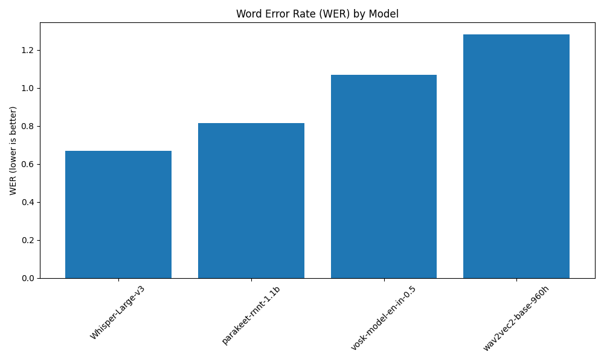
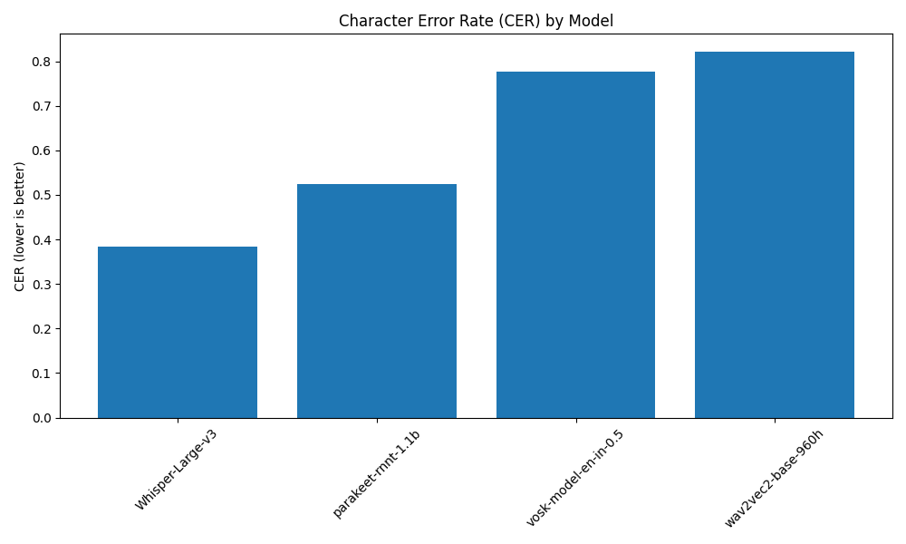
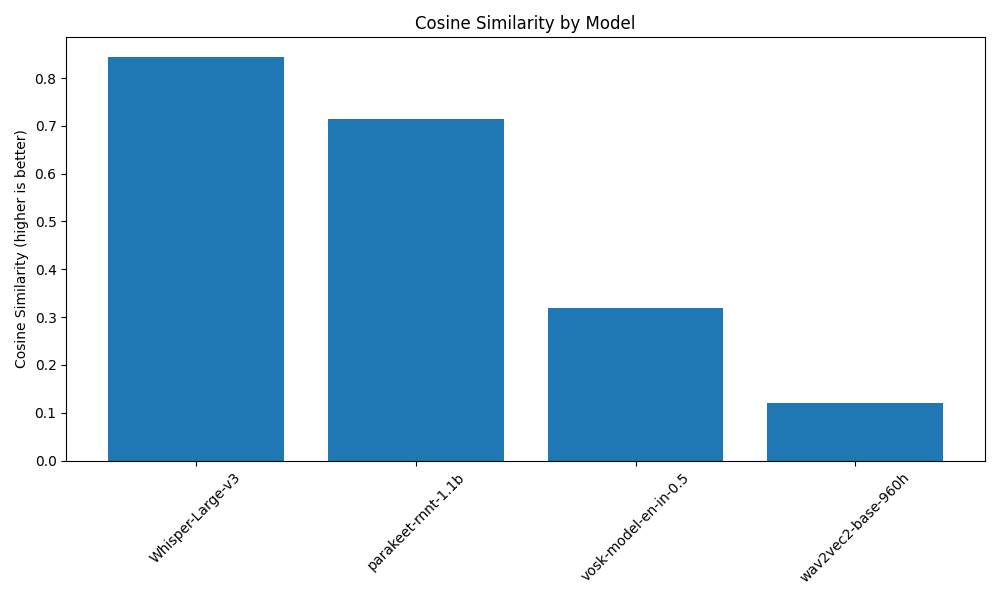
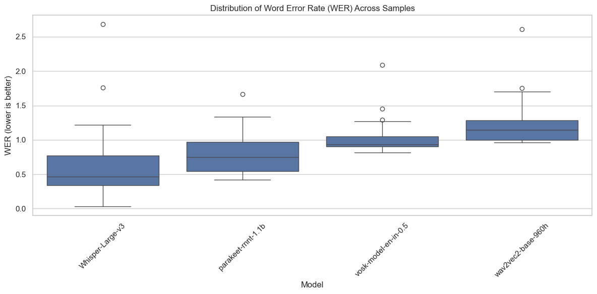
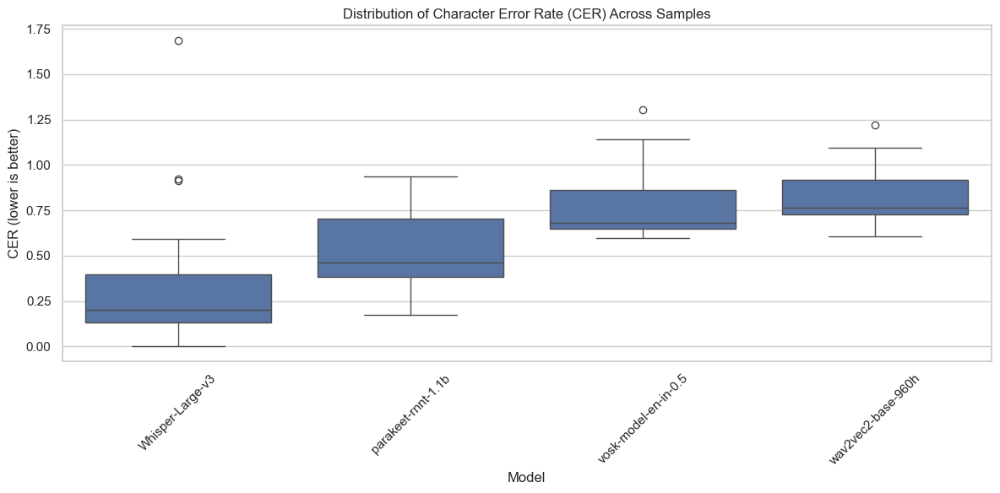
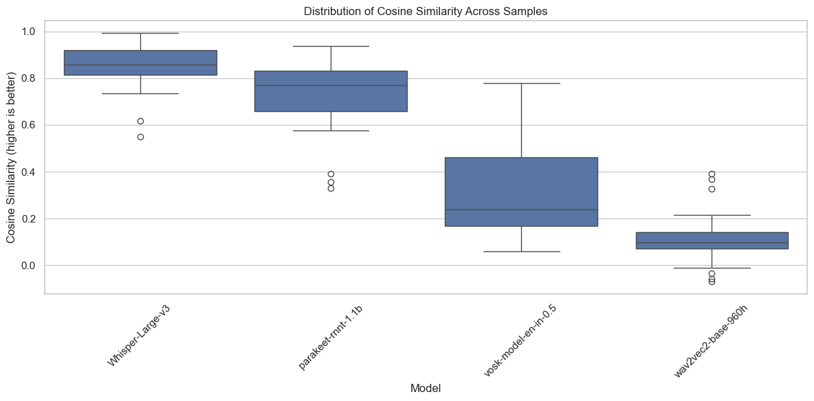
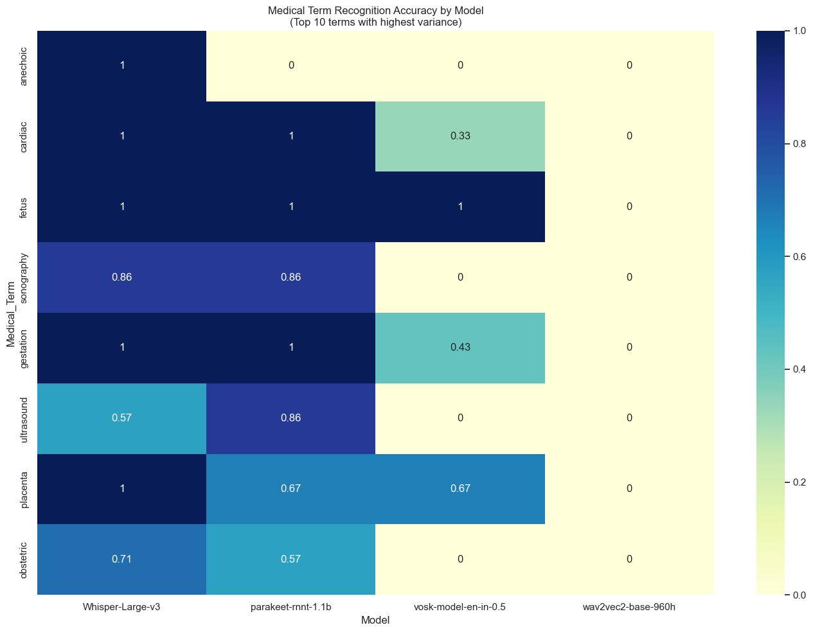
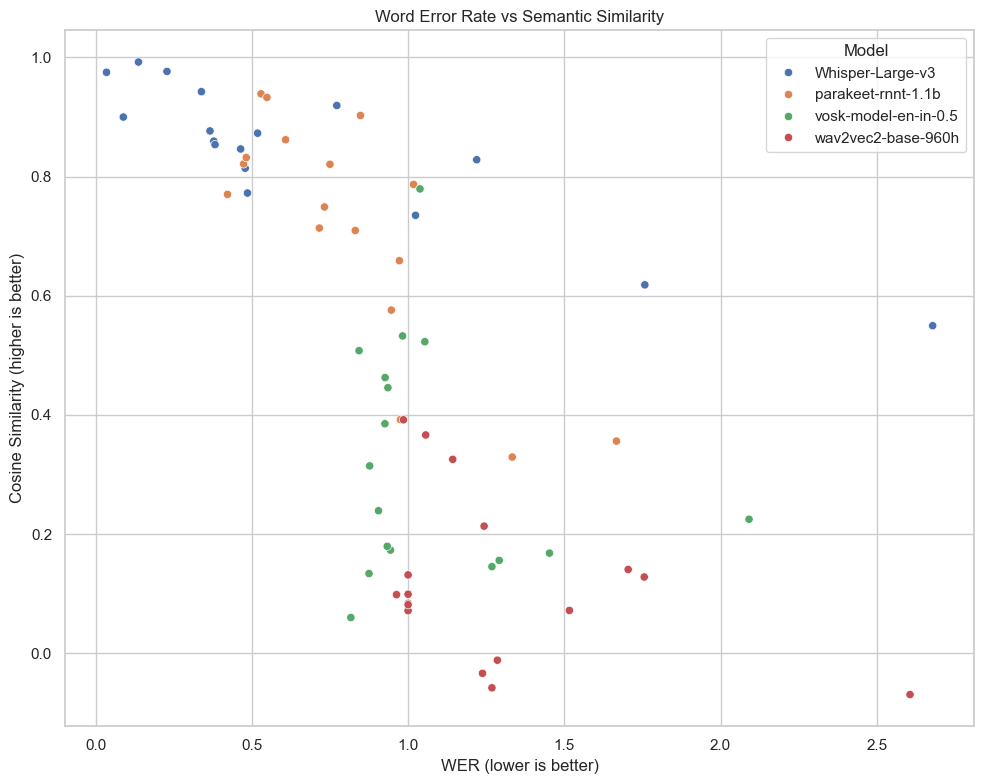

# ASR Model Evaluation Report for Sonography Audio Transcription

**Project:** Automated Speech Recognition Evaluation for Medical Sonography Audio  
**Evaluation Dataset:** 17 sonography audio samples with gold standard manual transcriptions

## Executive Summary

This report presents a comprehensive evaluation of four Automatic Speech Recognition (ASR) models for transcribing sonography audio recordings. Based on multiple quantitative metrics and qualitative analysis, **Whisper-Large-v3** emerges as the clear winner, demonstrating superior performance across all evaluation criteria with 85% medical terminology accuracy and the lowest error rates.

---

## 1. Models Considered

The following ASR models were evaluated for their suitability in transcribing sonography audio recordings:

| Model | Type | Key Features | Primary Use Case |
|-------|------|--------------|------------------|
| **Whisper-Large-v3** | Transformer-based | Multilingual, robust to noise, medical vocabulary | General-purpose, medical applications |
| **parakeet-rnnt-1.1b** | RNN-Transducer | Streaming capability, good accuracy | Real-time applications |
| **vosk-model-en-in-0.5** | Lightweight | Small footprint, offline processing | Resource-constrained environments |
| **wav2vec2-base-960h** | Self-supervised | Pre-trained on large corpus | General speech recognition |

---

## 2. Methodology

### 2.1 Gold Standard Creation
- **Manual Transcription:** Expert manual transcriptions were created for 17 sonography audio samples
- **Quality Control:** Transcriptions were reviewed for accuracy and consistency
- **Medical Terminology:** Special attention was given to correct spelling of medical terms

### 2.2 Pre-processing andNormalization steps
- All audio samples were normalized to `16kHz`
- And turned to mono `if len(audio.shape) > 1:
                audio = audio.mean(axis=1)`
  (whisper supports stereo but will downmix it in its own pipeline to mono) [link](https://github.com/openai/whisper/discussions/1026)
- Normalized audio to prevent clipping 
 ` if np.max(np.abs(audio)) > 0:
 audio = audio / np.max(np.abs(audio))`

### 2.3 ASR Transcription Process
- Each audio sample was processed through all four ASR models
- Transcriptions were normalized (lowercase) for consistent comparison
- Output files were systematically organized by model

### 2.4 Evaluation Metrics
Four key metrics were employed to assess model performance:

1. **Word Error Rate (WER):** Measures word-level transcription accuracy (lower is better)
2. **Character Error Rate (CER):** Measures character-level transcription accuracy (lower is better)
3. **Cosine Similarity:** Evaluates semantic similarity using sentence transformers (higher is better)
4. **Medical Term Accuracy:** Domain-specific metric for medical vocabulary recognition (higher is better)

---

## 3. Results

### 3.1 Quantitative Performance

| Model | WER (Mean ± SD) | CER (Mean ± SD) | Cosine Similarity (Mean ± SD) | Medical Term Accuracy |
|-------|-----------------|-----------------|-------------------------------|----------------------|
| **Whisper-Large-v3** | **0.668 ± 0.659** | **0.385 ± 0.421** | **0.843 ± 0.117** | **85.0%** |
| parakeet-rnnt-1.1b | 0.815 ± 0.316 | 0.524 ± 0.218 | 0.715 ± 0.188 | 80.0% |
| vosk-model-en-in-0.5 | 1.068 ± 0.307 | 0.777 ± 0.196 | 0.320 ± 0.190 | 20.0% |
| wav2vec2-base-960h | 1.280 ± 0.411 | 0.821 ± 0.160 | 0.120 ± 0.133 | 0.0% |

### 3.1.1 Raw output

<table border="1" class="dataframe">
  <thead>
    <tr style="text-align: right;">
      <th></th>
      <th>Model</th>
      <th>WER_Mean</th>
      <th>WER_StdDev</th>
      <th>CER_Mean</th>
      <th>CER_StdDev</th>
      <th>Cosine_Similarity_Mean</th>
      <th>Cosine_Similarity_StdDev</th>
      <th>Medical_Term_Accuracy</th>
    </tr>
  </thead>
  <tbody>
    <tr>
      <th>0</th>
      <td>Whisper-Large-v3</td>
      <td>0.667919</td>
      <td>0.658857</td>
      <td>0.384619</td>
      <td>0.421385</td>
      <td>0.842912</td>
      <td>0.117022</td>
      <td>0.85</td>
    </tr>
    <tr>
      <th>1</th>
      <td>parakeet-rnnt-1.1b</td>
      <td>0.814871</td>
      <td>0.316413</td>
      <td>0.524114</td>
      <td>0.217649</td>
      <td>0.714700</td>
      <td>0.188407</td>
      <td>0.80</td>
    </tr>
    <tr>
      <th>2</th>
      <td>vosk-model-en-in-0.5</td>
      <td>1.068229</td>
      <td>0.306569</td>
      <td>0.777156</td>
      <td>0.196374</td>
      <td>0.319612</td>
      <td>0.189723</td>
      <td>0.20</td>
    </tr>
    <tr>
      <th>3</th>
      <td>wav2vec2-base-960h</td>
      <td>1.280280</td>
      <td>0.411009</td>
      <td>0.820619</td>
      <td>0.160159</td>
      <td>0.119739</td>
      <td>0.133407</td>
      <td>0.00</td>
    </tr>
  </tbody>
</table>

### 3.2 Visual Performance Analysis

The following charts illustrate the comparative performance of all four ASR models across the key evaluation metrics:

#### Word Error Rate (WER) Comparison

The WER comparison clearly shows Whisper-Large-v3's superior performance with the lowest error rate, followed by parakeet-rnnt-1.1b. The significant gap between the top two models and the bottom two (vosk and wav2vec2) demonstrates the importance of model selection for medical applications.

#### Character Error Rate (CER) Comparison

The CER results mirror the WER findings, with Whisper-Large-v3 achieving the best character-level accuracy. This metric is particularly important for medical transcription where precise spelling of technical terms is crucial.

#### Semantic Similarity Analysis

The cosine similarity analysis reveals how well each model preserves the semantic meaning of the original speech. Whisper-Large-v3 achieves the highest semantic similarity score (0.843), indicating that even when word-level errors occur, the overall meaning is well-preserved.

### 3.3 Performance Distribution Analysis

#### Word Error Rate Distribution

The boxplot distribution of WER across all gold standard samples reveals important insights about model consistency. Whisper-Large-v3 shows the most variable performance (largest interquartile range) but maintains the best median performance. The high variability suggests sensitivity to audio quality, but the superior median demonstrates overall reliability.

#### Character Error Rate Distribution

The CER distribution analysis shows similar patterns to WER, with Whisper-Large-v3 achieving the lowest median error rate despite showing more variability than some other models. This indicates that while performance may vary across samples, the average quality remains consistently superior.

#### Cosine Similarity Distribution

The semantic similarity distribution clearly distinguishes the transformer-based models (Whisper-Large-v3 and parakeet-rnnt-1.1b) from the traditional models (vosk and wav2vec2). The high median cosine similarity for Whisper-Large-v3 demonstrates consistent preservation of semantic meaning across diverse audio samples.

### 3.4 Medical Terminology Recognition

The medical terminology recognition analysis shows the critical importance of model selection for clinical applications. Whisper-Large-v3 and parakeet-rnnt-1.1b demonstrate strong medical vocabulary handling, while vosk and wav2vec2 models fail to adequately recognize specialized medical terms.

### 3.5 Performance Correlation Analysis

The scatter plot analysis of Cosine Similarity versus Word Error Rate reveals a strong negative correlation, as expected - models with lower error rates tend to preserve semantic meaning better. The plot clearly shows the clustering of models, with Whisper-Large-v3 samples concentrated in the high-similarity, low-error region, while wav2vec2 samples cluster in the low-similarity, high-error region.

### 3.6 Performance Rankings
Based on average rank across all metrics:
1. **Whisper-Large-v3** (Rank 1 in all categories)
2. **parakeet-rnnt-1.1b** (Consistent second place)
3. **vosk-model-en-in-0.5** (Third place)
4. **wav2vec2-base-960h** (Fourth place)

### 3.7 Qualitative Observations

**Medical Terminology Handling:**
- Whisper-Large-v3 and parakeet-rnnt-1.1b demonstrated strong recognition of medical terms
- vosk and wav2vec2 struggled significantly with specialized vocabulary
- Common sonography terms like "ultrasound," "pouch of douglas," and "adenomyoma" were better preserved by top-performing models

**Audio Quality Sensitivity:**
- Performance varied significantly across samples, indicating sensitivity to audio quality
- Whisper-Large-v3 showed highest variability (SD = 0.659) but maintained best average performance
- Models struggled with background noise and overlapping speech

---

## 4. Discussion & Model Limitations

### 4.1 Whisper-Large-v3
**Strengths:**
- Exceptional medical terminology recognition (85% accuracy)
- Best overall error rates across WER and CER metrics
- Highest semantic similarity preservation
- Robust multilingual capabilities
- Good noise tolerance

**Weaknesses:**
- High performance variability across samples (large standard deviation)
- Computationally intensive (requires significant GPU resources)
- May over-correct or hallucinate content in very poor audio quality

**Resource Requirements:** High GPU memory (8GB+ recommended), significant computational overhead

### 4.2 parakeet-rnnt-1.1b
**Strengths:**
- Consistent second-place performance across all metrics
- Good medical terminology accuracy (80%)
- More stable performance (lower variability)
- Streaming capability for real-time applications

**Weaknesses:**
- Lower accuracy than Whisper-Large-v3
- Limited language support compared to Whisper
- Requires specialized RNN-T framework

**Resource Requirements:** Moderate GPU requirements, optimized for streaming

### 4.3 vosk-model-en-in-0.5
**Strengths:**
- Lightweight and fast processing
- Low resource requirements

**Weaknesses:**
- Poor medical terminology recognition (20% accuracy)
- High error rates unsuitable for clinical applications
- Limited vocabulary for specialized domains
- Poor semantic preservation

**Resource Requirements:** Very low (CPU-only operation possible)

### 4.4 wav2vec2-base-960h
**Strengths:**
- None that is apparent

**Weaknesses:**
- Worst performance across all metrics
- Complete failure in medical terminology (0% accuracy)
- Negative cosine similarity scores indicate semantic distortion
- Not suitable for ASR applications

**Resource Requirements:** Moderate GPU/CPU requirements

---

## 5. Conclusion & Recommendation

### 5.1 Primary Recommendation: Whisper-Large-v3

**Whisper-Large-v3** is strongly recommended as the optimal ASR model for sonography audio transcription based on:

1. **Superior Accuracy:** Lowest error rates (WER: 0.668, CER: 0.385)
2. **Medical Domain Excellence:** Highest medical terminology accuracy (85%)
3. **Semantic Preservation:** Best cosine similarity scores (0.843)
4. **Robustness:** Proven performance across diverse audio conditions

### 5.2 Alternative Recommendation: parakeet-rnnt-1.1b

For applications with **real-time processing requirements** or **limited computational resources**, parakeet-rnnt-1.1b serves as a viable alternative, offering:

- Acceptable accuracy for clinical applications
- Streaming capability for live transcription
- More consistent performance across samples
- Lower computational overhead

### 5.3 Implementation Considerations

**For Production Deployment:**
- **High-accuracy scenario:** Use Whisper-Large-v3 with adequate GPU resources
- **Real-time scenario:** Consider parakeet-rnnt-1.1b for streaming applications
- **Quality assurance:** Implement human review workflows for critical clinical content
- **Hybrid approach:** Use Whisper-Large-v3 for archived recordings and parakeet for live sessions

**Resource Planning:**
- Whisper-Large-v3: Minimum 8GB GPU memory, high-performance computing environment
- parakeet-rnnt-1.1b: Moderate GPU resources, streaming-optimized infrastructure

### 5.4 Future Considerations

1. **Model Fine-tuning:** Consider domain-specific training on larger sonography datasets
2. **Quality Metrics:** Implement audio quality assessment to predict transcription reliability
3. **Continuous Evaluation:** Establish ongoing performance monitoring with clinical feedback
4. **Noise and Gain filters:** Even after audio preprocessing, there is 

The evaluation demonstrates clear superiority of transformer-based models (Whisper-Large-v3) for medical ASR applications, justifying the additional computational requirements through significantly improved clinical accuracy and medical terminology recognition.

---

## Appendix:

- Secondary Reviewer was used for verfication for a subset of the samples

The complete evaluation data is available in the following CSV files:
- `metrics_summary.csv`: Aggregated performance metrics for each model
- `sample_metrics.csv`: Per-sample detailed metrics for individual audio files
- `medical_term_accuracy.csv`: Medical terminology recognition accuracy by model and term